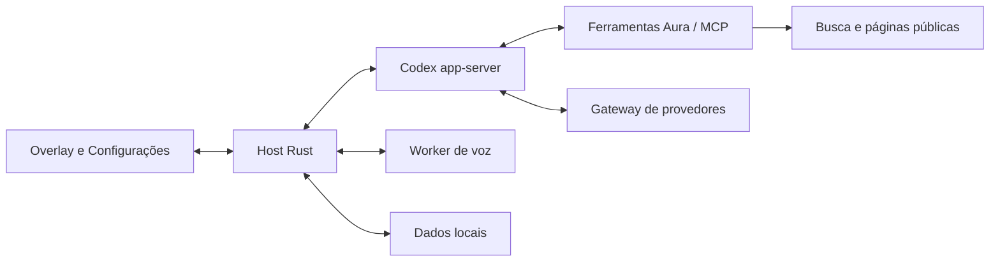

<div align="center">
  

# Aura

**Seu assistente de IA no Windows, a um atalho de distância.**

Converse, pesquise na web e trabalhe com o contexto da sua tela.

Windows AI assistant · ChatGPT sign-in · Local voice · Free web search

[](https://github.com/VIDORETTO/aura-windows/releases/latest)
[](#licença)
[](#instalação)
[](rust-toolchain.toml)
[](apps/desktop/src-tauri/Cargo.toml)

[**Baixar Aura**](https://github.com/VIDORETTO/aura-windows/releases/latest) · [Primeiros passos](#primeiros-passos) · [Guia de uso](docs/usage.md) · [Desenvolvimento](#desenvolvimento) · [Reportar problema](https://github.com/VIDORETTO/aura-windows/issues)

</div>

## Sobre

O Aura fica na bandeja do Windows. Pressione **Ctrl+Shift+Espaço** para abrir o Overlay e conversar com uma IA sem sair do aplicativo em que está trabalhando. Conecte sua conta ChatGPT ou configure um provedor compatível, inclusive um servidor local.

A versão **0.3.0** adiciona pesquisa e leitura de páginas da internet com fontes clicáveis, restaura a escolha de modelo e raciocínio e corrige a mudança involuntária de monitor durante a conversa. Veja o [changelog](CHANGELOG.md) e as [notas da release](https://github.com/VIDORETTO/aura-windows/releases/tag/v0.3.0).

## Recursos

| Recurso | O que você pode fazer |
| --- | --- |
| Pesquisa web | Buscar e ler páginas públicas, consultar as fontes e interromper a pesquisa. Sem chave paga de busca. |
| Modelos e raciocínio | Escolher o modelo disponível no seu provedor e os níveis de raciocínio que ele suporta. |
| Contexto da tela | Compartilhar uma região, texto selecionado ou contexto recente conforme sua política de privacidade. |
| Voz | Ditar com transcrição local, escolher microfone/áudio do sistema e ouvir respostas. |
| Anexos | Enviar imagens, documentos, planilhas, PDFs com texto e arquivos de áudio/vídeo. |
| Chat, Tarefa e Plano | Conversar, executar trabalho com ferramentas ou preparar um plano. |
| Reuniões | Preparar, transcrever e salvar notas com marcadores e receitas. |
| Organização | Consultar histórico, memórias, notas, lembretes e perfis por aplicativo. |
| Extensões | Usar Skills, comandos rápidos e servidores MCP. |
| Interface | Overlay, Minibar, atalhos globais, temas e idiomas português/inglês. |

A busca não exige assinatura de um serviço de pesquisa. O acesso ao modelo continua sujeito ao plano ou provedor escolhido. Páginas podem limitar consultas ou exigir login; o Aura apresenta essas limitações.

## Instalação

**Requisitos:** Windows 10/11 x64 e WebView2. É necessário acesso à internet para baixar componentes, usar modelos remotos e pesquisar na web.

1. Abra a [última release](https://github.com/VIDORETTO/aura-windows/releases/latest).
2. Baixe **`Aura_0.3.0_x64-setup.exe`** e execute o instalador. O pacote MSI também está disponível para instalações administradas.
3. Abra o Aura e conclua a configuração inicial. O aplicativo permanece na bandeja.
4. Pressione **Ctrl+Shift+Espaço** para abrir a conversa.

Os instaladores têm assinaturas para verificação pelo updater do Aura e hashes SHA-256 na release. Essa assinatura de atualização não equivale a um certificado Authenticode do Windows.

## Primeiros passos

1. Em **Configurações → Conta e modelos**, conecte o ChatGPT ou adicione seu provedor.
2. Abra o Overlay e escolha o **modelo** e o **raciocínio** pelo seletor. As opções dependem das capacidades do modelo.
3. Revise as permissões de tela e áudio em **Privacidade**.
4. Experimente: “Pesquise as diretrizes WCAG 2.2 no site do W3C e cite as fontes”. Clique numa fonte para abrir a página original.
5. Para perguntar sobre uma parte da tela, digite **@região** e selecione a área. **Ctrl+Shift+S** anexa a tela inteira.

Leia o [guia de uso](docs/usage.md) para comandos, contexto, reuniões e modos de trabalho.

## Configuração

| Página | Principais opções |
| --- | --- |
| Geral | Aparência, idioma, pesquisa web, comportamento do Overlay e ocultação em capturas. |
| Conta e modelos | Login ChatGPT, provedores, modelos e raciocínio por modo. |
| Privacidade | Permissões, exclusões por aplicativo, retenção e registro de acessos. |
| Voz | Modelos de transcrição, dispositivos e leitura de respostas. |
| Extensões e perfis | Skills, comandos rápidos, servidores MCP e preferências por aplicativo. |
| Lembretes e notas | Consultar, pesquisar e remover itens salvos. |
| Atalhos e diagnóstico | Personalizar atalhos e exportar diagnósticos. |

Os dados ficam no perfil local do Aura (`%LOCALAPPDATA%\Aura`). Credenciais usam o Vault protegido por DPAPI. Consulte [privacidade e arquitetura](docs/architecture/overview.md) para detalhes de armazenamento e limites.

## Atalhos

| Atalho padrão | Ação |
| --- | --- |
| Ctrl+Shift+Espaço | Abrir ou ocultar o Overlay |
| Ctrl+Shift+S | Anexar a tela |
| Ctrl+Espaço (segurar) | Ditar com o Overlay aberto |
| Ctrl+Alt+Espaço | Ditar em qualquer aplicativo |
| Ctrl+Shift+L | Ler a resposta em voz alta |
| Ctrl+Shift+Enter | Substituir seleção |
| Enter | Enviar ou colocar mensagem na fila durante uma resposta |
| Ctrl+Enter | Orientar o agente durante a resposta |
| `/` e `@` | Comandos e contexto |

Os atalhos globais são configuráveis. Veja a [referência completa](docs/usage.md).

## Atualização e remoção

Nas versões **0.2.0 ou posteriores**, procure atualizações em **Configurações → Sobre**. A 0.3.0 mantém a chave permanente e o endpoint do updater. Se você ainda usa a 0.1.0, instale a versão atual pelo instalador da release; a migração de chave exigiu uma versão de transição.

Para remover o aplicativo, use **Configurações do Windows → Aplicativos**. Antes de apagar o perfil local, exporte os dados que deseja guardar.

## Solução de problemas

| Sintoma | Próximo passo |
| --- | --- |
| O Aura não aparece | Confira a bandeja e use o atalho global. |
| Modelo não aparece | Confira a conexão em Conta e modelos e tente carregar o catálogo novamente. |
| Pesquisa sem resultados | Consulte a mensagem de erro; tente outra consulta ou uma página pública acessível. |
| Voz indisponível | Instale um modelo de transcrição e confira o dispositivo selecionado. |
| Contexto não foi capturado | Revise as permissões e exclusões em Privacidade. |
| Texto de outro aplicativo não é reconhecido | O resultado depende do suporte do aplicativo a UI Automation e OCR. |

Se o problema continuar, abra uma [issue](https://github.com/VIDORETTO/aura-windows/issues) com versão, passos para reproduzir e diagnóstico sem dados pessoais. Para vulnerabilidades, use o canal privado descrito em [SECURITY.md](SECURITY.md).

---

## Documentação técnica

### Arquitetura

| Camada | Tecnologia e responsabilidade |
| --- | --- |
| Desktop | Tauri 2 e adaptadores Windows para janelas, atalhos, captura e áudio. |
| Interface | React 19, TypeScript estrito, Tailwind 4 e Zustand. |
| Host | Rust: orquestração, comandos tipados e política de privacidade. |
| Agente | Codex app-server fixado em 0.159.0; login ChatGPT ou gateway para provedores. |
| Pesquisa web | `aura-web`: busca, leitura, extração de conteúdo e referências de fontes. |
| Voz | Worker separado, motores locais e suporte a DirectML. |
| Persistência | SQLite, dados cifrados conforme domínio e Vault protegido pelo Windows. |
| Extensões | Skills, comandos rápidos e MCP. |



Leia [CONTEXT.md](CONTEXT.md), a [visão de arquitetura](docs/architecture/overview.md) e os [ADRs](docs/adr/). O [HANDOFF](docs/HANDOFF.md) registra evidências e trabalho pendente.

### Estrutura

```text
apps/desktop/       React, shell Tauri e testes E2E
crates/             Host, domínio, agente, web, armazenamento e adaptadores
docs/               Arquitetura, design, guias e relatórios de QA
specs/              Contratos, planos, tickets e evidências Hybrid
scripts/            Preparação de sidecars e distribuição
.hybrid/            Runner do Hybrid Development Kit
```

### Desenvolvimento

Use **Rust 1.98.1**, **Node.js 22** e **pnpm 12.5.1**. Para o aplicativo nativo, instale MSVC Build Tools, Windows SDK e WebView2. Os motores de voz também exigem CMake e libclang (`LIBCLANG_PATH`).

```powershell
git clone https://github.com/VIDORETTO/aura-windows.git
cd aura-windows
pnpm -C apps/desktop install --frozen-lockfile
./scripts/prepare-sidecars.ps1 -Release -DirectML
pnpm -C apps/desktop tauri dev
```

Para trabalhar apenas na interface, `pnpm -C apps/desktop dev` usa o backend simulado. Para uma demonstração nativa sem conta, use `pnpm -C apps/desktop tauri dev --features demo`.

```powershell
# Testes no Windows, sem o shell Tauri
cargo test --workspace --exclude aura-desktop
pnpm -C apps/desktop test
pnpm -C apps/desktop typecheck
cargo fmt --all -- --check
cargo clippy --workspace --all-targets -- -D warnings

# Build de distribuição; assinatura exige configuração local do updater
pnpm -C apps/desktop tauri build
```

O bundle é produzido em `target/release/bundle/`. A chave privada de assinatura é externa ao repositório. Consulte o [relatório de distribuição](docs/qa/release-020-2026-10-05.md) antes de alterar o updater ou a preparação de motores.

Testes nativos usam WebDriver e um perfil isolado; veja [apps/desktop/e2e](apps/desktop/e2e). Mudanças no contrato IPC seguem o [ADR 0009](docs/adr/0009-contrato-ipc-dourado.md). Contribuições seguem [CONTRIBUTING.md](CONTRIBUTING.md) e [AGENTS.md](AGENTS.md).

| Variável opcional | Uso |
| --- | --- |
| `AURA_HOME` | Perfil isolado para desenvolvimento e QA. |
| `AURA_CODEX_BIN` | Caminho do app-server para testes controlados. |
| `AURA_GATEWAY_DUMP_DIR` | Diagnóstico de tráfego; pode conter conversas, mantenha privado. |

### Verificação e distribuição

O GitHub Actions permanece **desativado** enquanto a preparação dos motores no ambiente hospedado é validada. A 0.3.0 é compilada e verificada localmente; os resultados ficam no [esforço de publicação](specs/041-publicacao-github-030). A existência de um workflow não comprova que ele foi executado.

Instaladores, assinaturas do updater, manifesto e hashes são publicados em [Releases](https://github.com/VIDORETTO/aura-windows/releases). Tags anteriores permanecem disponíveis.

### Privacidade e limites conhecidos

- Captura e acesso a contexto seguem permissões e exclusões por aplicativo. Revise esses controles antes de compartilhar tela ou áudio com um modelo remoto.
- Resultados web têm entrega transitória para evitar guardar texto bruto de páginas nos rollouts do agente. O [ADR 0010](docs/adr/0010-entrega-transitoria-de-resultados-web.md) descreve a solução.
- Rollouts do Codex têm armazenamento próprio: não trate todo o perfil como integralmente cifrado.
- A busca depende da disponibilidade das páginas e dos serviços gratuitos; login, CAPTCHA e páginas dependentes de JavaScript podem impedir leitura.
- A estabilidade em dois monitores foi testada em escala 100%. Os testes nativos dos seletores em 150% e 200% continuam pendentes no esforço 038.
- A validação dos instaladores em uma máquina Windows limpa continua pendente. O aplicativo é desenvolvido para Windows; o Host pode ser testado em outros sistemas.

### Comunidade

- [Contribuir](CONTRIBUTING.md) e [Código de conduta](CODE_OF_CONDUCT.md)
- [Bugs e pedidos de recursos](https://github.com/VIDORETTO/aura-windows/issues)
- [Segurança](SECURITY.md)
- [Fila do projeto](docs/project/backlog.md), [changelog](CHANGELOG.md) e [releases](https://github.com/VIDORETTO/aura-windows/releases)

### Licença

Aura é distribuído sob **MIT OR Apache-2.0**, à sua escolha: [MIT](LICENSE-MIT) e [Apache-2.0](LICENSE-APACHE). É um projeto independente; as marcas dos provedores pertencem aos respectivos titulares.
