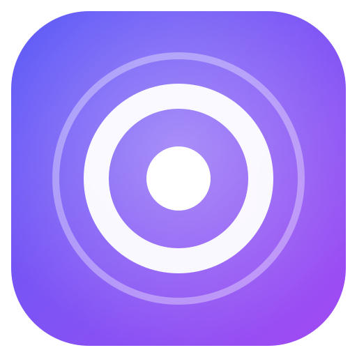
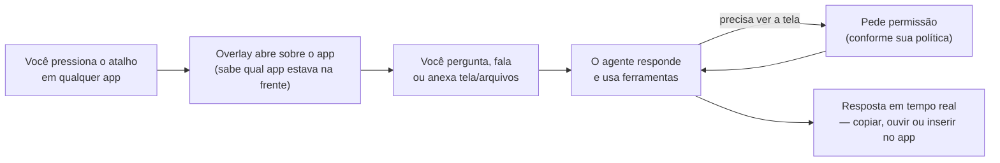
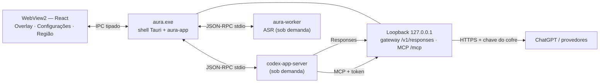

<div align="center">



# Aura

**Assistente de IA flutuante para Windows: um atalho abre um Overlay onde você pergunta sobre a tela, fala ou anexa arquivos — e continua no que estava fazendo.**

<em>A floating AI assistant for Windows: press a hotkey, ask about your screen, talk, attach files.</em>

[](https://github.com/VIDORETTO/aura-windows/actions/workflows/ci.yml)


[Sobre](#-sobre) · [Instalação](#-instalação) · [Uso](#-uso) · [Documentação técnica](#-documentação-técnica) · [Contribuir](#-contribuindo) · [Licença](#-licença)

</div>

> [!NOTE]
> **Pré-lançamento (0.1.0).** O núcleo e a interface estão implementados e testados, inclusive contra o Codex app-server real; a validação do app completo no Windows está em andamento. O estado detalhado de cada área está em [docs/HANDOFF.md](./docs/HANDOFF.md).

## 📖 Sobre

O Aura fica na bandeja do Windows. Quando você precisa de ajuda, um atalho abre uma janela translúcida sobre o app em que você está, já sabendo qual é esse app. Você pergunta, e a resposta chega em tempo real; se a pergunta depende da tela, você anexa a tela (ou deixa o agente pedir permissão para olhar).

Por baixo, o Aura é um agente de verdade, rodando sobre o [Codex app-server](https://github.com/openai/codex): pode usar ferramentas, pedir aprovação antes de executar comandos, planejar tarefas e usar Skills e servidores MCP. Você usa o seu plano ChatGPT ("Continuar com ChatGPT") ou a sua própria chave de API.

Para quem usa o Windows o dia todo e quer ajuda de IA sem trocar de janela, copiar e colar capturas ou abrir o navegador.

## ✨ Funcionalidades

- **Overlay por atalho** — o Aura inicia na bandeja; `Ctrl+Shift+Space` abre e fecha o Overlay (duplo `Ctrl` opcional). Fica fora do Alt+Tab e da barra de tarefas, é excluído de capturas e compartilhamento de tela e pode ser redimensionado.
- **Contexto de tela sob o seu controle** — anexe a tela, a janela ativa, uma região, o texto selecionado, uma imagem colada (`Ctrl+V`) ou os últimos minutos do buffer como "Chips" visíveis antes do envio. A seleção é atualizada sempre que você volta ao Overlay depois de selecionar texto em outro app. O agente pode pedir para olhar: *permitir uma vez*, *nesta conversa* ou *negar*.
- **Privacidade por fonte** — tela, microfone e áudio do sistema têm cada um um modo: *desligado*, *sob demanda*, *últimos N minutos* (1 a 30), *gravação manual* ou *sempre gravando*. Janelas de gerenciadores de senha e navegação privada são cobertas por padrão; há pausa global, retenção configurável (dias e espaço) e um registro de acesso com data e hora exatas, motivo, miniatura do que o agente recebeu e link para a conversa.
- **Memória recente** — com o buffer ligado, você anexa os últimos minutos (tela, microfone, sistema ou ambos) e o agente consegue ver quadros e a transcrição rotulada ("Você"/"Sistema"). Os segmentos ficam cifrados no disco, com retenção automática.
- **Gravações** — gravação manual com duração, player no próprio Aura, anexar à conversa (áudio é transcrito) e exportar.
- **Seu plano ChatGPT ou sua chave** — 14 predefinições de provedores (OpenAI, Azure OpenAI, OpenRouter, Anthropic, Google Gemini, Groq, DeepSeek, Mistral, xAI, Together AI, Ollama, LM Studio, vLLM e personalizado). Edite protocolo, cabeçalhos e modelos manuais com capacidades (imagem, ferramentas, raciocínio) e os esforços que cada modelo aceita, com o esforço padrão. Inclui o **GPT-6.1 Sol** (no plano ChatGPT e em provedores compatíveis, com esforços até *Max*). As chaves ficam no Cofre do Windows.
- **Esforço de raciocínio por modelo e modo** — escolha *Nenhum*, *Mínimo*, *Baixo*, *Médio*, *Alto*, *Muito alto* ou *Máximo* (conforme o modelo) para Chat, Tarefa e Plano; o Aura lembra a escolha feita no seletor e há uma tabela em Configurações › Conta e modelos.
- **Agente com ferramentas** — modos Chat, Tarefa (edita arquivos no workspace e em pastas que você liberar) e Plano; aprovações de comandos e alterações; painéis de arquivos gerados e alterações (com prévia de HTML e de PDF); `/compactar` resume uma conversa longa; histórico com busca, renomear e paginação.
- **Voz local** — segure `Ctrl+Space` para ditar no Overlay (com transcrição parcial ao vivo) ou use `Ctrl+Alt+Space` para ditar em qualquer app. Catálogo com velocidade, precisão e recomendação conforme o seu hardware; modelos Parakeet e Whisper baixados e verificados por SHA-256; escolha e teste de microfone e áudio do sistema com medidor; transcrição na nuvem opcional como reserva; vocabulário personalizado.
- **Anexos** — PDF, planilhas (XLSX/XLS/ODS/CSV), documentos (DOCX/ODT/RTF), apresentações (PPTX/ODP), texto, código, HTML, imagens, áudio e vídeo. O agente pode ler partes específicas depois: páginas, abas e linhas, slides, seções ou intervalos de tempo.
- **Extensões** — Skills (origem, ativar/desativar, editar; criar ou importar com revisão), comandos rápidos com `/`, servidores MCP (stdio e HTTP, com OAuth, ferramentas por servidor, status e log de erros) e importação de configurações MCP do Claude Desktop, Cursor, VS Code e Codex CLI. Memórias revisáveis, editáveis e apagáveis.
- **Produtividade** — perfis por aplicativo (instruções, modo e modelo padrão por app), ouvir respostas em voz alta (voz do Windows offline ou voz de um provedor na nuvem, com confirmação no primeiro uso, e leitura automática), "Inserir no app", Minibar enquanto a resposta roda em segundo plano e notificação ao terminar.
- **Diagnóstico completo** — motor do agente, Gateway, servidores MCP, worker de voz, capturas ativas, conta (e-mail mascarado) e espaço em disco; exportação redigida.
- **Interface em português e inglês**, temas claro/escuro/sistema, **cor de destaque à sua escolha** (cores prontas, seletor RGB ou código hex), opacidade ajustável e suporte a alto contraste.

## 🧠 Como funciona



1. **Atalho** — o Aura registra o app que estava na frente (e o texto selecionado nele) e abre o Overlay no mesmo monitor. Com o Overlay aberto, voltar a ele depois de selecionar texto em outro app atualiza a seleção.
2. **Contexto** — o que for enviado aparece antes como Chips (tela, seleção, arquivos); nada sai sem você ver.
3. **Agente** — o motor Codex responde e, quando precisa, usa as ferramentas do Aura (ver a tela, ler texto de janelas, ler anexos) respeitando a política de privacidade.
4. **Resultado** — a resposta chega em streaming, com Markdown e código destacado.

## 📋 Requisitos

**Para usar**

- Windows 10 (2004 ou mais recente) ou Windows 11, com o WebView2 Runtime.
- Conta ChatGPT com plano, **ou** uma chave de API de um provedor compatível (ou um servidor local como Ollama/LM Studio).
- Na primeira execução, internet para baixar e verificar o motor do agente (Codex app-server) — e, se quiser voz local, o modelo escolhido.

**Para compilar**

| Ferramenta | Versão |
|---|---|
| Rust | 1.98.1 (fixado em [`rust-toolchain.toml`](./rust-toolchain.toml)) |
| Node.js + pnpm | Node 22 (versão usada no CI) |
| Visual Studio Build Tools | "Desktop development with C++" (MSVC + Windows SDK) |
| CMake + LLVM/Clang | Só para compilar os motores de voz locais |

## 📦 Instalação

Ainda não há instaladores publicados em [Releases](https://github.com/VIDORETTO/aura-windows/releases); por enquanto o Aura é compilado a partir do código-fonte, no Windows.

```powershell
git clone https://github.com/VIDORETTO/aura-windows.git
cd aura-windows
```

```powershell
# 1. Dependências da interface
pnpm -C apps/desktop install

# 2. Processo auxiliar de voz (sidecar exigido pelo empacotador)
./scripts/prepare-sidecars.ps1 -Release

# 3. Gerar o instalador (NSIS por usuário e MSI)
pnpm -C apps/desktop tauri build
```

Os instaladores ficam em `target/release/bundle/`. O instalador NSIS instala **só para o seu usuário** (sem privilégios de administrador).

**Verificar:** depois de instalar, o ícone do Aura aparece na bandeja (com uma notificação) e `Ctrl+Shift+Space` abre o Overlay.

<details>
<summary><b>Rodar a versão mais recente do código com um clique (<code>iniciar-aura.bat</code>)</b></summary>

Na raiz do repositório, `iniciar-aura.bat` recompila só o que mudou e inicia o Aura:

- o app (`target\release\aura.exe`) quando o código for mais novo que o executável;
- o worker de voz com os motores locais (Parakeet/Whisper) quando estiver ausente, desatualizado ou sem motores — precisa de CMake e libclang (`LIBCLANG_PATH`).

Opções: `-Demo` (agente simulado), `-Rebuild`, `-Pull` (`git pull --ff-only` antes) e `-NoStart`. O Aura inicia na bandeja; rodar o `.bat` de novo, o atalho ou o ícone da bandeja abrem o Overlay.

</details>

<details>
<summary><b>Experimentar sem conta (modo demonstração)</b></summary>

O modo demo usa um agente simulado e capturas sintéticas — útil para conhecer a interface sem ChatGPT ou chave de API:

```powershell
pnpm -C apps/desktop tauri dev --features demo
```

Também dá para abrir só a interface no navegador, com um backend simulado (em qualquer sistema operacional):

```bash
pnpm -C apps/desktop dev
```

</details>

## ⚙️ Configuração

Quase tudo é configurado dentro do app, em **Configurações** (`Ctrl+,` no Overlay):

| Página | O que você configura |
|---|---|
| Geral | Tema, cor de destaque, opacidade, idioma, iniciar com o Windows, comportamento ao perder o foco, instruções pessoais, modelo padrão, memórias (revisar/editar/apagar), retomar primeiros passos |
| Conta e modelos | Login "Continuar com ChatGPT", troca de conta, sair; esforço de raciocínio por modelo e modo |
| Provedores | Provedores com a sua chave (testar conexão, modelos descobertos, modelos manuais com capacidades e esforços) |
| Privacidade | Modo e permissão do agente por fonte, minutos do buffer, retenção (dias/espaço), pausa, janelas excluídas, gravações (player, anexar, exportar), registro de acesso |
| Voz | Modelos de reconhecimento (catálogo, download/uso/remoção), microfone e áudio do sistema com teste, idioma, transcrição na nuvem, vocabulário, enviar após ditar, leitura em voz alta (voz, voz na nuvem, leitura automática) |
| Extensões | Skills, servidores MCP (ferramentas, status e logs), comandos rápidos |
| Perfis de app | Instruções, modo e modelo padrão aplicados por aplicativo |
| Atalhos | Atalhos globais e duplo toque em `Ctrl` |
| Diagnóstico | Estado do motor do agente, Gateway, MCP, worker de voz, capturas, conta e disco; exportar diagnóstico redigido; apagar todos os dados |

**Onde ficam os dados**

| Local | Conteúdo |
|---|---|
| `%LOCALAPPDATA%\Aura\` | Banco de configurações, workspaces das conversas, gravações cifradas, modelos de voz, logs |
| Gerenciador de Credenciais do Windows (`Aura/…`) | Tokens do ChatGPT, chaves de API, segredos de servidores MCP |

**Variáveis de ambiente (avançado)**

| Variável | Obrigatória | Padrão | Descrição |
|---|---|---|---|
| `AURA_HOME` | Não | `%LOCALAPPDATA%\Aura` | Pasta de dados alternativa |
| `AURA_CODEX_BIN` | Não | — | Usa um Codex app-server local em vez de baixar o binário fixado (sem verificação) |
| `AURA_GATEWAY_DUMP_DIR` | Não | — | Diagnóstico de protocolo: grava as requisições do agente ao gateway local. Contém conteúdo de conversas — não use no dia a dia |

## 🚀 Início rápido

1. Abra o Aura (ele fica na bandeja) e pressione `Ctrl+Shift+Space`.
2. Clique em **Continuar com ChatGPT** e conclua o login no navegador — ou clique em **Usar minha chave** e adicione um provedor.
3. Siga os primeiros passos (privacidade, atalho e voz) ou pule.
4. Com um erro na tela, pressione `Ctrl+Shift+S` para anexar a tela e pergunte: *"o que significa esse erro?"*.

A resposta chega em streaming no Overlay, que se expande para mostrar a conversa.

## 🧑‍💻 Uso

### Atalhos globais (padrões, alteráveis em Configurações › Atalhos)

| Atalho | Ação |
|---|---|
| `Ctrl+Shift+Space` | Abrir/fechar o Aura |
| `Ctrl+Space` (segurar, com o Aura aberto) | Falar em vez de digitar |
| `Ctrl+Alt+Space` | Ditar em qualquer app (pressione para começar, de novo para inserir o texto) |
| `Ctrl+Shift+Alt+P` | Pausar/retomar toda captura |

### No Overlay

| Tecla | Ação |
|---|---|
| `Enter` / `Shift+Enter` | Enviar / nova linha |
| `Ctrl+Enter` durante a resposta | Direcionar a resposta atual |
| `Ctrl+.` | Interromper |
| `Ctrl+Shift+S` | Anexar a tela |
| `Ctrl+Shift+L` | Ouvir a última resposta (de novo para parar) |
| `Ctrl+Shift+Enter` | Inserir a última resposta (ou o trecho selecionado nela) no app anterior |
| `Ctrl+V` com imagem | Anexar a imagem da área de transferência |
| `Ctrl+N` / `Ctrl+Shift+E` | Nova conversa / conversa efêmera (não fica no histórico) |
| `Ctrl+H` / `Ctrl+,` | Histórico / Configurações |
| `Ctrl+↑` / `Ctrl+↓` | Compactar / expandir |
| `Esc` | Fechar menu → cancelar ditado → fechar histórico (nunca esconde o Overlay; use o atalho ou **Minimizar para a bandeja**) |

### Adicionar contexto com `@`

Digite `@` para anexar **tela**, **região** (seleção sobre a tela congelada), **janela ativa**, **seleção**, **arquivo** ou **últimos minutos** (buffer recente de tela e/ou áudio: microfone, sistema ou ambos). Arquivos também podem ser arrastados para o Overlay e imagens coladas com `Ctrl+V`.

A seleção vem do app anterior via UI Automation: ao abrir o Overlay pelo atalho, ou ao voltar a ele depois de selecionar texto em outro app, ela aparece como um único Chip (uma nova seleção substitui a anterior). Apps cujos campos não expõem o texto pela acessibilidade do Windows não fornecem a seleção.

### Comandos rápidos com `/`

| Comando | O que faz |
|---|---|
| `/tldr` | Resume em até três frases |
| `/formal` · `/curto` · `/amigavel` | Reescreve a seleção no tom pedido |
| `/golpe` | Analisa se uma mensagem, e-mail, link ou boleto parece golpe |
| `/responder [tom]` | Anexa a tela e escreve um rascunho de resposta |
| `/lembrar <o quê e quando>` | Cria um lembrete com notificação do Windows (únicos ou recorrentes) |
| `/anota <texto>` · `/notas <busca>` | Guarda e procura anotações rápidas |
| `/texto` | Arraste sobre uma área da tela e o texto (OCR) vai para a área de transferência |
| `/configurar <pedido>` | A IA configura o Aura por você, mostrando antes → depois |
| `/preparo <assunto>` | A IA entrevista você (⚡ uma frase ou 🧭 grill-me) antes de uma tarefa |
| `/parei` | Resume o que você fazia nos últimos minutos (precisa do buffer de tela) |
| `/traduzir <idioma>` | Traduz (padrão: inglês) |
| `/reescrever` | Reescreve com mais clareza |
| `/explicar` | Explica de forma simples |
| `/corrigir` | Corrige ortografia e gramática |
| `/resumir-tela` | Anexa a tela e resume o que está nela |
| `/plano` | Entra no modo Plano |
| `/tela` | Anexa a tela |
| `/compactar` | Resume a conversa atual para liberar contexto |

Os comandos usam a seleção, o texto digitado ou os anexos. Você pode criar os seus em Configurações › Extensões, e suas Skills também aparecem no menu `/`.

### Modos de conversa

| Modo | O agente pode |
|---|---|
| **Chat** | Responder e ler; nunca altera nada |
| **Tarefa** | Criar e alterar arquivos no workspace da conversa e em pastas que você liberar, com aprovação |
| **Plano** | Pesquisar e planejar; não executa |

Dá para trocar de modo no meio da conversa pelo mesmo seletor: aparece "Modo alterado para …" e, a partir da mensagem seguinte, o agente segue o modo novo (as permissões do turno mudam e ele é avisado de que o modo anterior não vale mais).

O esforço de raciocínio fica no mesmo seletor (modelo e modo). O valor escolhido é lembrado para aquele modelo e modo e volta sozinho na próxima vez; em **Configurações › Conta e modelos › Esforço por modelo e modo** você vê e muda todos de uma vez. Modelos de provedores personalizados mostram os esforços que você cadastrou para eles.

## ⬆️ Atualizando

O Aura tem atualização automática assinada: **Configurações › Sobre › Verificar atualizações**. Ela só funciona em compilações com a chave pública de assinatura configurada e com releases publicadas; sem a chave, o app informa que as atualizações automáticas não estão configuradas. Até lá, atualize compilando uma versão nova (veja [Instalação](#-instalação)) ou rode `iniciar-aura.bat -Pull`.

## 🗑️ Desinstalação

1. **Opcional, para remover tudo:** em **Configurações › Diagnóstico**, use **Apagar todos os meus dados** — remove conversas, gravações, configurações e as credenciais do Aura no Gerenciador de Credenciais.
2. Desinstale o Aura em **Configurações do Windows › Aplicativos › Aplicativos instalados**.
3. Se não usou o passo 1, apague a pasta `%LOCALAPPDATA%\Aura` e as entradas `Aura/…` do Gerenciador de Credenciais do Windows.

## 🛠️ Solução de problemas

| Sintoma | O que fazer |
|---|---|
| Aviso "O atalho … está em uso" | Outro app usa a mesma combinação. Escolha outra em Configurações › Atalhos |
| "Baixando o motor do agente…" não termina ou falha | Verifique a conexão; o download é verificado por SHA-256 e retomado. Em redes restritas, use `AURA_CODEX_BIN` |
| "Escolha um modelo de voz em Configurações › Voz" | Baixe um modelo (o recomendado para o seu hardware aparece marcado) ou configure a transcrição na nuvem |
| "O microfone está desligado nas configurações de privacidade" | Em Configurações › Privacidade, mude o modo do microfone de *Desligado* |
| Chip "bloqueado: janela excluída" | A janela em foco está na lista de exclusões (Configurações › Privacidade) |
| Chip "bloqueado: privacidade pausada" | Retome com `Ctrl+Shift+Alt+P` ou pelo menu da bandeja |
| O Aura abriu e não apareceu janela | É o esperado: ele inicia na bandeja. Use `Ctrl+Shift+Space`, o ícone da bandeja ou execute-o de novo |
| A seleção não vira Chip | O app de origem não expõe o texto via UI Automation, ou a privacidade está pausada / a janela está excluída. Copie e cole o texto, ou use `@tela` |
| Áudio anexado: "a speech model is needed…" | Instale um modelo de voz em Configurações › Voz (a transcrição do áudio é local) |
| "Atualizações automáticas não estão configuradas" | A compilação não tem a chave de assinatura do updater; atualize pelo código-fonte |
| Precisa de ajuda do suporte | Configurações › Diagnóstico › **Exportar diagnóstico** gera um `.zip` sem chaves, tokens nem conteúdo de conversas |

---

# 🔧 Documentação técnica

## 🏗️ Visão técnica

| Camada | Tecnologia |
|---|---|
| Shell desktop | Tauri 2 (WebView2) |
| Interface | React 19, TypeScript, Tailwind CSS 4, Zustand, Vite |
| Host | Rust 1.98.1 (edition 2024), Tokio, Axum |
| Agente | Codex app-server `rust-v0.159.0` (sidecar sob demanda, SHA-256 fixado) |
| Login | Sign in with ChatGPT (OAuth + PKCE) |
| Gateway de modelos | Servidor local `/v1/responses`: repassa (Responses) ou traduz (Chat Completions, Anthropic Messages) |
| Ferramentas do agente | Servidor MCP local (streamable HTTP, token por execução) |
| Dados | SQLite; cofre AES-256-GCM com chave protegida por DPAPI; Gerenciador de Credenciais do Windows |
| Captura | GDI (tela/janelas), UI Automation e Windows OCR (texto), WASAPI via cpal (áudio), Media Foundation (H.264 e decodificação de mídia) |
| Voz | Worker sob demanda com `transcribe-rs` (Parakeet, Whisper) |

## 🏛️ Arquitetura



- O **host** (`crates/aura-app`) compõe todos os serviços e expõe um método por comando da interface; o shell Tauri só encaminha chamadas e eventos.
- O **gateway** injeta o token do plano ChatGPT ou a chave do provedor — o motor do agente nunca vê segredos.
- Toda captura de tela ou áudio passa pelo motor de política (`crates/aura-policy`) **antes** de acontecer.
- As APIs do Windows ficam isoladas em `crates/aura-win`, atrás de traits com adaptadores de teste — por isso quase tudo compila e é testado em qualquer SO.

Detalhes: [docs/architecture/overview.md](./docs/architecture/overview.md) e as [decisões arquiteturais (ADRs)](./docs/adr/).

## 📁 Estrutura do projeto

```text
aura/
├── apps/desktop/
│   ├── src/                # Interface React: overlay/, settings/, state/, ipc/, i18n/, ui/
│   ├── src-tauri/          # Shell Tauri: comandos, janelas, bandeja, atalhos, plataforma Windows
│   └── e2e/                # Testes ponta a ponta (WebdriverIO + tauri-driver, Windows)
├── crates/
│   ├── aura-core/          # Domínio: configurações, atalhos, chips, JSON-RPC, logs com redação
│   ├── aura-store/         # SQLite, migrações, cofre cifrado
│   ├── aura-policy/        # Motor de política de privacidade
│   ├── aura-codex/         # Cliente e supervisor do Codex app-server
│   ├── aura-auth/          # Sign in with ChatGPT
│   ├── aura-gateway/       # Gateway local e tradução de provedores
│   ├── aura-mcp/           # Servidor MCP do Aura
│   ├── aura-capture/       # Frames, redação, segmentos cifrados, retenção
│   ├── aura-audio/         # Captura e gravação de áudio
│   ├── aura-asr/           # Catálogo, downloads e transcrição
│   ├── aura-ingest/        # Leitura de anexos
│   ├── aura-extensions/    # Skills, comandos rápidos, servidores MCP
│   ├── aura-app/           # Núcleo do host (composição, comandos, eventos)
│   ├── aura-win/           # Adaptadores do Windows
│   └── aura-worker/        # Processo auxiliar de ASR
├── tools/aura-bench/       # Orçamentos de desempenho
├── bench/                  # Linha de base de desempenho
├── docs/                   # Arquitetura, ADRs, design, QA, HANDOFF
├── specs/                  # Especificações, planos e tickets (Hybrid Development Kit)
└── scripts/                # Build com baixa prioridade, preparo de sidecars
```

## 🧑‍🔧 Desenvolvimento

A maior parte do código é independente de SO e roda em Linux/macOS; o app completo exige Windows.

| Comando | Finalidade |
|---|---|
| `cargo test` | Testes Rust dos crates padrão (qualquer SO) |
| `cargo test --workspace --exclude aura-desktop` | Testes Rust no Windows |
| `cargo clippy --all-targets -- -D warnings` | Lint Rust |
| `cargo fmt --all -- --check` | Formatação Rust |
| `cargo check -p aura-win --target x86_64-pc-windows-msvc` | Checar tipos dos adaptadores Windows a partir de Linux |
| `pnpm -C apps/desktop dev` | Interface no navegador com backend simulado |
| `pnpm -C apps/desktop test` | Testes da interface (Vitest) |
| `pnpm -C apps/desktop typecheck` | Checagem de tipos TypeScript |
| `pnpm -C apps/desktop build` | Build da interface |
| `pnpm -C apps/desktop tauri dev [--features demo]` | App completo no Windows (real ou demonstração) |

Formatos de IPC são travados por um contrato compartilhado entre Rust e TypeScript (ADR 0009). Depois de mudar um formato, atualize [`apps/desktop/src/ipc/types.ts`](./apps/desktop/src/ipc/types.ts) e regenere o arquivo de referência:

```bash
UPDATE_GOLDEN=1 cargo test -p aura-app --test ipc_contract
```

## 🧪 Testes

| Tipo | Comando |
|---|---|
| Unitários e integração (Rust) | `cargo test` |
| Interface, contrato de IPC, i18n e acessibilidade (axe) | `pnpm -C apps/desktop test` |
| Ponta a ponta com o Codex app-server real (opt-in) | `AURA_CODEX_BIN=/caminho/codex-app-server cargo test -p aura-app --test real_app_server -- --ignored` |
| Ponta a ponta no Windows | `pnpm -C apps/desktop/e2e install` e `pnpm -C apps/desktop/e2e test --spec ./specs/<spec>.e2e.ts` com `AURA_E2E_APP` e um `AURA_HOME` isolado; `overlay.e2e` usa a build `--features demo`, as demais o app de produção (detalhes em [docs/qa/HANDOFF-correcao-auditoria-2026-10-03.md](./docs/qa/HANDOFF-correcao-auditoria-2026-10-03.md)) |
| Desempenho | `cargo run -p aura-bench --release -- all --pid <pid> --out bench/latest.json --baseline bench/baseline.json` |

Roteiros manuais: [acessibilidade](./docs/qa/acessibilidade.md) e [instalação e atualização](./docs/qa/instalacao.md).

## 🔁 CI/CD

| Workflow | Quando | O que faz |
|---|---|---|
| [`ci.yml`](./.github/workflows/ci.yml) | Push em `main` e pull requests | Rust no Linux (fmt, clippy, testes, licenças com `cargo deny`, checagem do alvo Windows) · interface (tipos, testes, build) · Windows (testes, clippy, build do app) · E2E no Windows (build demo) |
| [`perf.yml`](./.github/workflows/perf.yml) | Manual e semanal | Mede com `aura-bench` e compara com `bench/baseline.json` |
| [`release.yml`](./.github/workflows/release.yml) | Tags `v*` | Confere a chave do updater (`scripts/check-updater-key.mjs`) e gera instaladores e artefatos do updater como release em rascunho |

## 🔐 Segurança

- Segredos só no Gerenciador de Credenciais do Windows; nunca em logs, arquivos de configuração ou na interface.
- Gateway e servidor MCP escutam só em `127.0.0.1`, em porta aleatória, com token por execução.
- O Overlay é excluído de capturas de tela; o motor do agente e os modelos são verificados por SHA-256.
- Logs passam por redação de chaves e tokens.

Veja a política completa e como reportar vulnerabilidades em [SECURITY.md](./SECURITY.md).

## ⚠️ Limitações

- **Só Windows.** O núcleo compila em outros sistemas, mas captura, atalhos, cofre e áudio dependem de APIs do Windows.
- **Pré-lançamento.** Os 42 achados da auditoria funcional foram corrigidos e verificados no app real, exceto o arraste com DPI 125%/150% (não testado) e a chave de assinatura do updater (ainda não configurada) — ver [docs/qa/auditoria-e2e-2026-10-02.md](./docs/qa/auditoria-e2e-2026-10-02.md). Não há instaladores publicados.
- **Seleção de texto** depende de UI Automation (TextPattern); não há cópia sintética com `Ctrl+C`.
- **Cor de destaque** não muda o ícone da bandeja nem o do executável.
- **Anexos:** até 200 MB por arquivo, 500 páginas por PDF e 2 horas de áudio/vídeo. PDFs escaneados dependem de OCR; codecs de áudio/vídeo além de WAV dependem do Media Foundation do Windows.
- **Voz local** exige compilar o worker com os motores (`--features engines`, CMake e Clang); sem isso, use a transcrição na nuvem.
- **OCR** depende dos pacotes de idioma instalados no Windows.
- **Histórico de conversas:** os arquivos de histórico do Codex ficam protegidos pelo perfil do Windows, mas não são cifrados pelo Aura; conversas efêmeras não geram histórico.

---

## 🗺️ Roadmap

Os marcos (M1–M5) e os candidatos futuros estão em [docs/project/roadmap.md](./docs/project/roadmap.md); o backlog gerado está em [docs/project/backlog.md](./docs/project/backlog.md).

## 🤝 Contribuindo

Contribuições são bem-vindas. Leia [CONTRIBUTING.md](./CONTRIBUTING.md) e o [código de conduta](./CODE_OF_CONDUCT.md). Em resumo: um assunto por pull request, testes primeiro na interface pública do módulo, `clippy -D warnings`, `rustfmt`, `pnpm typecheck` e testes passando. Mudança de comportamento começa pela especificação em [`specs/`](./specs/).

## 💬 Suporte

- **Dúvidas e bugs:** abra uma [issue](https://github.com/VIDORETTO/aura-windows/issues/new/choose) usando os modelos de bug ou sugestão; anexe o diagnóstico exportado pelo app.
- **Vulnerabilidades:** não abra issue pública — use o [reporte privado de vulnerabilidades](https://github.com/VIDORETTO/aura-windows/security/advisories/new) (veja [SECURITY.md](./SECURITY.md)).

## 📜 Versões

As mudanças estão em [CHANGELOG.md](./CHANGELOG.md); instaladores e notas de versão ficam em [Releases](https://github.com/VIDORETTO/aura-windows/releases).

## 📄 Licença

Licença dupla, à sua escolha: [MIT](./LICENSE-MIT) ou [Apache-2.0](./LICENSE-APACHE).

"ChatGPT" e "OpenAI" são marcas da OpenAI. O Aura é um projeto independente.
