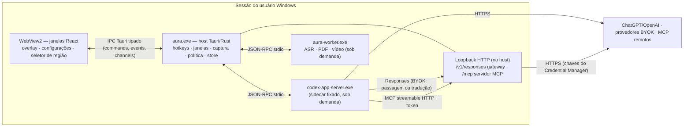

# Arquitetura suficiente: Aura

Esta página fixa o desenho que todos os esforços consomem. Decisões difíceis de reverter estão em `docs/adr/`. Detalhes locais pertencem ao `plan.md` de cada esforço.

## Processos



| Processo | Vida | Responsabilidade | Por que separado |
| --- | --- | --- | --- |
| `aura.exe` | Sempre (bandeja) | Hotkeys, janelas, login ChatGPT (SIWC) e renovação de tokens, captura de tela/áudio, motor de política, store criptografado, supervisão de sidecars, gateway e servidor MCP em loopback | Núcleo leve e confiável |
| WebView2 | Janela do overlay pré-criada e oculta; Configurações criada sob demanda | Toda a UI | Imposto pelo Tauri |
| `codex-app-server.exe` | Sobe na primeira conversa; encerra após inatividade (padrão 15 min) | Loop agêntico, threads, tools, MCP, skills, aprovações (o login ChatGPT é do host, via SIWC) | Binário oficial fixado (ADR 0001) |
| `aura-worker.exe` | Sobe quando há transcrição/ingestão pesada; encerra após inatividade (padrão 2 min) | Inferência ASR, render de PDF, decodificação de vídeo | Devolve memória ao SO e isola falhas de bibliotecas nativas (ADR 0005) |

## Módulos (workspace Cargo + app)

```
aura/
├─ apps/desktop/
│  ├─ src/                 # React: overlay, settings, region-selector, design system
│  └─ src-tauri/           # crate `aura-desktop`: wiring, comandos Tauri, janelas
├─ crates/
│  ├─ aura-core/           # tipos de domínio, eventos, erros, relógio, ids
│  ├─ aura-store/          # SQLite + migrações, cofre (DPAPI + AES-GCM), retenção
│  ├─ aura-policy/         # motor de política de captura e acesso do agente (puro)
│  ├─ aura-codex/          # cliente JSON-RPC do app-server, supervisor, mapeamento de itens
│  ├─ aura-gateway/        # servidor Responses local e adaptadores (chat, anthropic)
│  ├─ aura-mcp/            # servidor MCP do Aura (ferramentas de tela/áudio/contexto)
│  ├─ aura-capture/        # tela: WGC, região, ring buffer segmentado, OCR/UIA
│  ├─ aura-audio/          # WASAPI mic/loopback, ring buffer, codificação
│  ├─ aura-asr/            # catálogo, downloads, interface de transcrição
│  ├─ aura-ingest/         # anexos → texto/imagens (PDF, planilhas, docs, vídeo)
│  ├─ aura-extensions/     # Skills, comandos rápidos, config MCP, importadores
│  ├─ aura-app/            # núcleo do host: composição, comandos da UI, ferramentas, eventos
│  ├─ aura-win/            # adaptadores Windows (GDI, UIA, OCR, WASAPI, Cred. Manager, atalhos, MF)
│  └─ aura-worker/         # binário do worker (hospeda asr + ingest pesados)
├─ tools/aura-bench/       # orçamentos de desempenho
├─ docs/  specs/  .agents/  .hybrid/
```

Regra de dependência: `aura-core` não depende de nada do Windows. As APIs do SO ficam em `aura-win` (e DPAPI em `aura-store::protect`), atrás de traits (`FrameSource`, `WindowInventory`, `ScreenText`, `AudioSource`, `CredentialStore`, `SecretProtector`, `Foreground`) com um adapter real e um adapter de teste — permitindo testes em Linux/CI e um futuro porte. `aura-app` compõe tudo e expõe os comandos que o shell Tauri apenas encaminha. Captura na v1 via GDI (ADR 0008); contrato de IPC por arquivo dourado (ADR 0009).

## Fluxos principais

### Abrir overlay e perguntar sobre a tela (Marco 1)

1. Hook/atalho no host dispara `OverlayToggle`.
2. Host registra janela em primeiro plano (título, processo, monitor) **antes** de mostrar o overlay.
3. Overlay pré-criado é posicionado no monitor ativo e mostrado (sem recriar WebView2).
4. `/screen` ou clique no chip → host consulta `aura-policy` → captura via WGC excluindo o overlay → salva PNG no workspace da conversa → chip com miniatura.
5. Enviar → `aura-codex` garante app-server ativo → `thread/start` (provedor `aura-chatgpt-plan`, persona Aura em `base_instructions`) → `turn/start` com `text` + `localImage` → o app-server chama o Gateway, que injeta o access token SIWC vigente e repassa a `https://api.openai.com/v1/responses`.
6. Notificações `item/*` viram eventos tipados para a UI por um `Channel` Tauri; markdown renderizado incrementalmente.

### Login ChatGPT (SIWC)

O host executa o OAuth/PKCE do Sign in with ChatGPT (registro dinâmico na primeira vez, `agent_name_hint="Aura"`, `ext_agent_host_id` estável), valida o ID token e o escopo `chatgpt.tokens.use.direct`, guarda as credenciais no Credential Manager e renova o access token antes de expirar. O provedor `aura-chatgpt-plan` do `config.toml` aponta para o Gateway (`/p/chatgpt-plan/v1`), que injeta o token vigente — o app-server nunca vê o token nem precisa reiniciar na renovação. Ver ADR 0007.

### BYOK

`thread/start.model_provider = "aura-<id>"`. Todo Provedor BYOK é registrado no `config.toml` do Codex com `base_url = http://127.0.0.1:<porta>/p/<id>/v1` e `env_key = AURA_GATEWAY_TOKEN` (token de loopback por execução). O gateway lê a Credencial do Credential Manager, injeta-a e, conforme o formato do provedor, repassa (Responses) ou traduz (Chat Completions, Anthropic). Nenhuma chave BYOK chega ao processo do Codex. Ver ADR 0003.

### Ferramentas do agente

O host serve MCP streamable HTTP em `127.0.0.1:<porta>/mcp` com token por execução, registrado em `mcp_servers.aura` do `CODEX_HOME` isolado. Cada chamada passa por `aura-policy` (permitir, perguntar, negar) e é registrada no log de auditoria local visível na UI.

## Dados locais

`%LOCALAPPDATA%\Aura\`

| Caminho | Conteúdo | Proteção |
| --- | --- | --- |
| `aura.db` | Configurações, provedores (sem segredos), metadados de conversas, auditoria, índice de capturas | Campos sensíveis cifrados (AES-GCM, chave via DPAPI) |
| `codex-home\` | `config.toml` gerado pelo Aura (sem segredos), rollouts do Codex | Perfil do usuário; nenhum token no `CODEX_HOME` (login é do host) |
| Credential Manager (`Aura/...`) | Credenciais SIWC por conta (client_id emitido, id/access/refresh tokens), chaves BYOK, tokens de MCP | Cofre do Windows por usuário |
| `workspaces\<conversa>\` | Anexos e capturas usados em turnos, arquivos gerados | Perfil do usuário; removidos com a conversa |
| `captures\screen\`, `captures\audio\` | Segmentos de buffer/gravação | Cifrados por segmento; retenção aplicada |
| `models\asr\` | Modelos baixados | SHA-256 verificado |
| `bin\` | `codex-app-server-<versão>.exe`, `aura-worker.exe` | Assinatura/SHA-256 verificados antes de executar |
| `logs\` | Logs rotativos sem conteúdo de conversa | Redação de segredos |

Limitação registrada: os rollouts do Codex (histórico) são JSONL gerenciados pelo app-server e não são cifrados pelo Aura; ficam protegidos pelo perfil do Windows. Conversas efêmeras não geram rollout.

## Segurança

- Webview sem acesso a segredos; CSP restrita; comandos Tauri com capabilities mínimas por janela.
- Loopback: bind em `127.0.0.1`, porta aleatória, token aleatório por execução, rejeição de requisições com `Origin`.
- Sidecars verificados por SHA-256 fixado no build antes de cada execução.
- Overlay e seletor de região com `WDA_EXCLUDEFROMCAPTURE`.
- Política de captura aplicada no momento da captura (não depois).
- Aprovação humana para comandos, alterações de arquivo, permissões e tools MCP com efeito.

## Orçamentos de desempenho

| Métrica | Orçamento | Verificação |
| --- | --- | --- |
| Hotkey → overlay visível | ≤ 100 ms p95 (quente) | Esforço 001 TK-003 e 010 TK-004 |
| Memória ociosa (host + WebView2, overlay oculto, capturas off, app-server parado) | ≤ 150 MB working set privado | 010 TK-004 |
| CPU ociosa | ≤ 0,5% média em 5 min | 010 TK-004 |
| Buffer de tela 1 fps | ≤ 3% CPU, ≤ 300 MB/h | 004 TK-005 |
| Delta de token → pintura | ≤ 50 ms | 002 TK-003 |
| Tamanho do instalador (sem app-server e modelos) | ≤ 15 MB | 010 TK-001 |

## Testes (estratégia comum)

- **Rust**: `cargo nextest run --workspace`. Seams públicas de cada crate; adapters de teste apenas onde há variação real (SO, rede, relógio, processo externo).
- **Contrato com o Codex**: transcripts JSONL gravados de uma versão fixada do app-server reproduzidos por um app-server falso; schema TS gerado por `codex app-server generate-ts` commitado em `apps/desktop/src/generated/codex/`.
- **Gateway**: fixtures SSE reais de cada provedor gravadas; `wiremock` como upstream.
- **UI**: Vitest + Testing Library com `mockIPC` do Tauri na seam de IPC.
- **E2E**: WebdriverIO + `tauri-driver` em `windows-latest` para jornadas críticas.
- **Desempenho**: binário `aura-bench` coleta latência/memória via ETW/PDH e publica relatório.
- **Manuais**: itens visuais (translucidez, animações, invisibilidade em captura) têm roteiro no ticket e evidência por vídeo/print.

Comandos canônicos (definidos no esforço 001 TK-001): `pnpm test` (UI), `cargo nextest run --workspace` (Rust), `pnpm tauri build` (app), `pnpm e2e` (Windows).
